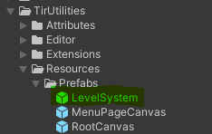

# Level System

This functions as a centralized system for loading scenes.  Loading scenes is usually a simple process, but leads to a lot of code duplication.  For example:

```cs
// This behaviour would need to be attached to each object that
// needs to will needs to start a scene transition.
public class Loader : MonoBehaviour
{
    [SerializeField] 
    private string _activeSceneName;
    [SerializeField] 
    private List<string> _additiveScenes = new List<string>();

    // This will load the scenes asynchronously.
    public void LoadLevel()
    {
        SceneManager.LoadSceneAsync(_activeSceneName)
            .completed += LevelLoader__completed;

        OnLoadComplete?.Invoke();
    }

    private static void LevelLoader__completed(AsyncOperation operation)
    {
        foreach (string scene in _additiveScenes)
            SceneManager.LoadSceneAsync(scene, LoadSceneMode.Additive);
    }
}
```

Maintaining these string references on multiple objects is cumbersome and error prone.  The level system avoids this by isolating all of the logic from the scene references.  A prefab with the level system attached can be found under Resources/Prefabs.



This object will be moved to DontDestroyOnLoad on awake.

---

## Usage

### Component Setup


The level system component should be placed on a game object that can be moved to DontDestroyOnLoad.  The optional root level data will be loaded if required, then each level load signal will be assigned the receiver <code>StartCoroutine(LevelLoader.LoadLevelDataAsync(levelData))</code>.  As a result, level signals SHOULD NOT be emitted in awake or start to avoid race conditions.

When the level system finishes loading a level it will emit the signal assigned to Load Complete Signal.

### Loading Levels

In this system level consist of an active scene and a set of optional additive scenes.  These are stored as a level data struct on a level load signal.  When adding new levels to your game, you must first create a new level load signal in the resources folder as pictured below.


Once the signal has bee created scenes can be assigned in the inspector.


To load a level, simply emit its signal.


